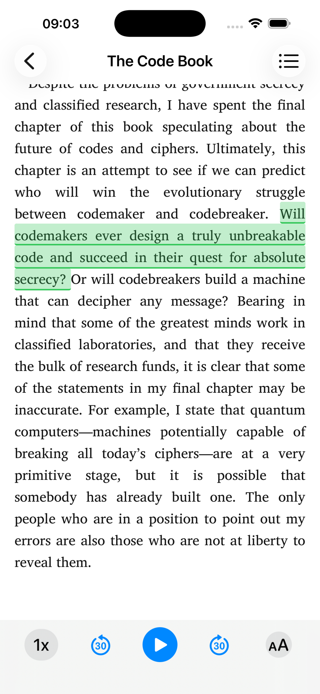
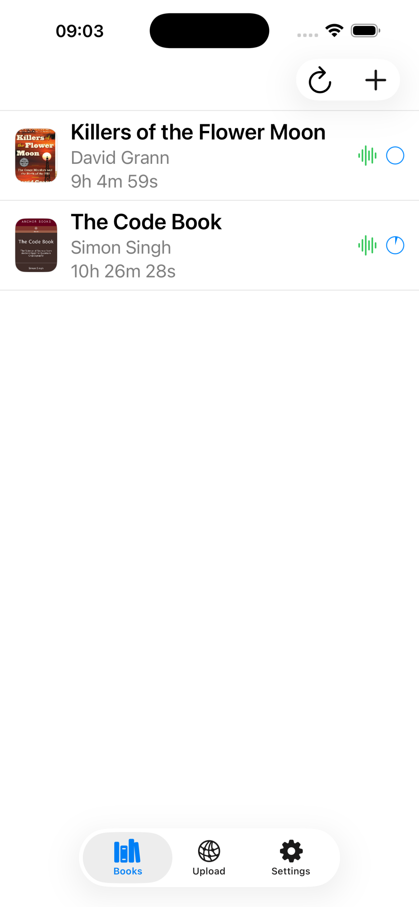
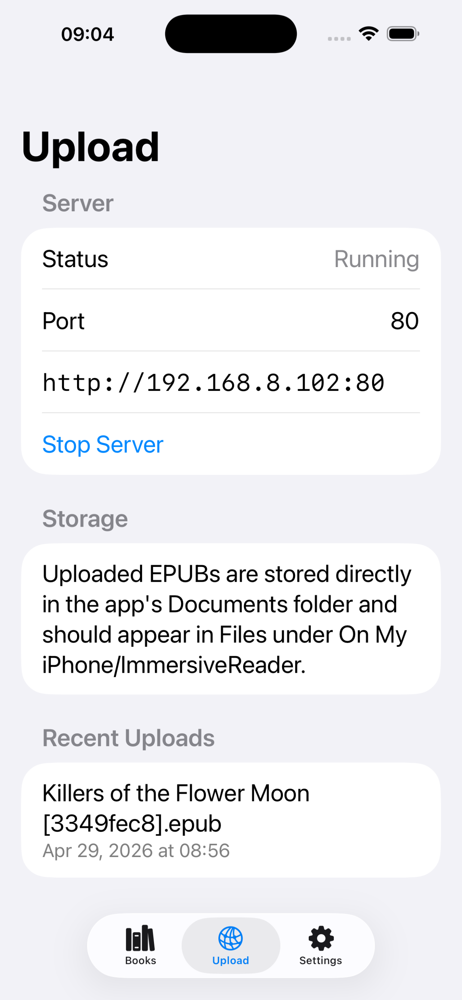
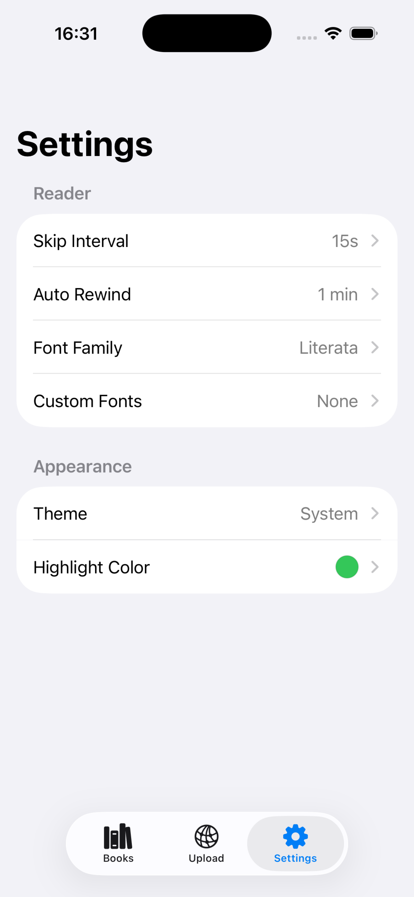

# EPUBPlayer

EPUBPlayer is an iOS/iPadOS EPUB reader built with SwiftUI, SwiftData, and Readium.

It focuses on EPUB3 reading with synced read-aloud playback, active text highlighting, upload/import workflows, custom font support, reading progress restore, chapter navigation, reader appearance controls, and resume-aware playback.

## Screenshots

| Reader | Library | Upload | Settings |
| --- | --- | --- | --- |
|  |  |  |  |

## Features

- Local network upload server for `.epub`, `.ttf`, and `.otf` files
- Read-aloud playback with active text highlighting
- Tap-to-play on spoken text
- Auto scroll with continuous reading
- Custom font import and family-based font management

## App Structure

The app has three tabs:

- `Books`: browse, import, refresh, delete, and open books
- `Upload`: run a local upload server and upload EPUB or custom font files
- `Settings`: reader typography, custom fonts, theme, and highlight color settings

## Reader Behavior

- Reader opens in scroll mode by default
- Playback bar appears only for books with parsed media overlays
- Active spoken text is highlighted in the EPUB view
- The highlight color can be customized from Settings
- Custom fonts can be imported from Settings and selected as one font-family choice even when they include multiple files such as regular and italic
- Imported custom font families are available after reopening the current book
- Chapter selection can jump playback to the first matching clip
- Manual scroll-and-stop can retarget playback to the first visible playable fragment
- Reopening a book with a saved last-played segment navigates to that segment and highlights it without autoplay
- Reopening a book with no saved played segment does not pre-highlight any text

## Storage Layout

- Imported EPUB files are stored in `Documents/Books/`
- Covers are stored in `Documents/Cache/Covers/`
- Media overlay manifests are stored in `Documents/Cache/MediaOverlays/`
- Audio cache files are stored in `Documents/Cache/AudioCache/`
- Upload staging files are stored in `Documents/Cache/Uploads/`
- Imported custom fonts are stored in `Documents/Cache/Fonts/`
- App state, settings, and reading progress are stored in `Documents/Cache/state.json`

Imported EPUBs are intended to appear in the Files app under `On My iPhone/EPUBPlayer/Books`.

Deleting the app `Documents` folder resets the library, settings, reading progress, custom fonts, and caches.

## Tech Stack

- SwiftUI
- SwiftData
- Readium Swift Toolkit
- AVFoundation
- Network.framework

## Build

Open the Xcode project:

- `EPUB Player.xcodeproj`

Or build from the command line:

```bash
xcodebuild -project "EPUB Player.xcodeproj" -scheme "EPUB Player" -destination 'generic/platform=iOS Simulator' build
```

## Notes

- The upload server is intended for devices on the same local network.
- HTTP upload accepts `.epub`, `.ttf`, and `.otf` files.
- Uploaded `.ttf` and `.otf` files are auto-imported into `Settings > Reader > Custom Fonts` using the same code path as the in-app custom font importer.
- Read-aloud features depend on EPUB media overlays being present and parsed successfully.
- Readium scroll mode in this setup is per-resource rather than a fully stitched whole-book vertical scroll.
